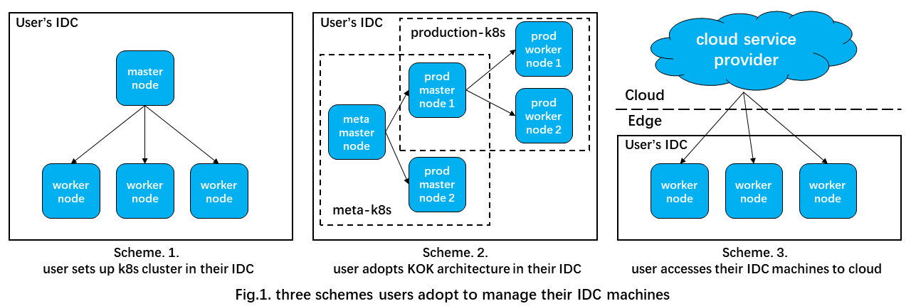
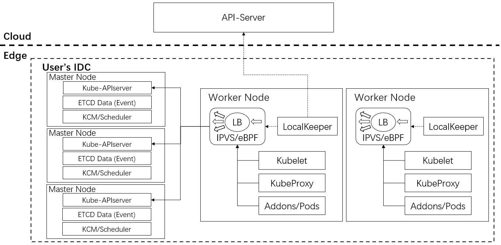

# Enhancing operational efficiency of k8s cluster in user's IDC

## Glossary

Refer to the [OpenYurt Glossary](https://github.com/openyurtio/openyurt/blob/master/docs/proposals/00_openyurt-glossary.md)

## Summary

It is difficult for users to operate, manage and upgrade the k8s cluster in their own IDC (Internet Data Center). The proposal aims to enhance the operational efficiency of k8s cluster in user's IDC by adopting KOK (Kubernetes-On-Kubernetes) architecture, where there are meta-k8s and production-k8s. Meta-k8s is located at cloud, provided by cloud service providers and can manage control plane of production-k8s, which we can simply access master nodes of production-k8s to cloud service providers, while production-k8s located at edge manages worker nodes in user's IDC.

## Motivation

For k8s clutesrs in user's IDC, it is difficult to operate, manage and upgrade the control plane components. Users typically adopt the following three schemes to manage k8s clusters in their IDC. 

- Some users only set up a single k8s cluster in IDC for production. In this case, when k8s have version upgrades and changes, about three major releases per year, there is a significant impact on user's service. Meanwhile, there is no resource elasticity capability in k8s clutesrs in user's IDC, such as scaling control plane components, which is a costly operation for user.

- Some users adopt the KOK architecture in their own IDC to manages production-k8s's control plane components. Both meta-k8s and production-k8s are in user's IDC. In this case, it is also hard to operate and upgrade the control plane components in meta-k8s.

- Some users don't set up the k8s cluster in their IDC, they only access their IDC machines to cloud service providers as worker nodes, utilizing the abilities of control plane in cloud service providers. In this case, if the dedicated line is not stable, the continuous release of operations may be affected, thus, more users tend to maintain their own k8s cluster in the IDC, instead of only accessing their IDC machines to cloud service providers as worker nodes.

We conclude above three schemes in Fig.1. The first and the second scheme both face the challenge of operating and upgrading the control plane components, the only difference is that the former is difficult to manage the control plane of IDC's own k8s cluster, while the latter is difficult to manage the control plane of meta-k8s, which manages the control plane of production-k8s. The third scheme is not suit the meet of users who want to maintain their own k8s cluster in the IDC.

This proposal provides a new scheme based on KOK architecture in Fig.2, where meta-k8s is located at cloud and production-k8s is located at edge IDC. In this scheme, we sufficiently utilize abilities of cloud service providers and develop new abilities in production-k8s to enhance operational efficiency for users.

### Goals

- Using the k8s on k8s architecture, sinking user's cluster control plane from the cloud to the edge, not only is there a significant reduction in cloud-side traffic, but the impact of cloud-side communication failures on user's releasing services is also reduced.

### Non-Goals/Future Work

## Proposal
### architecture

- Create the control plane of the local cluster on the three master nodes of the IDC (components are all deployed using Pods). 
- Through the node access tool, worker nodes in the IDC are accessed to the Local cluster.
- The LocalKeeper component on the node is mainly used for communication link maintenance, and the load balancing of Edge-Kube-APIServer access is realized by maintaining IPVS/eBPF or other schemes from the information in Cloud-Kube-APIServer on the worker node.

