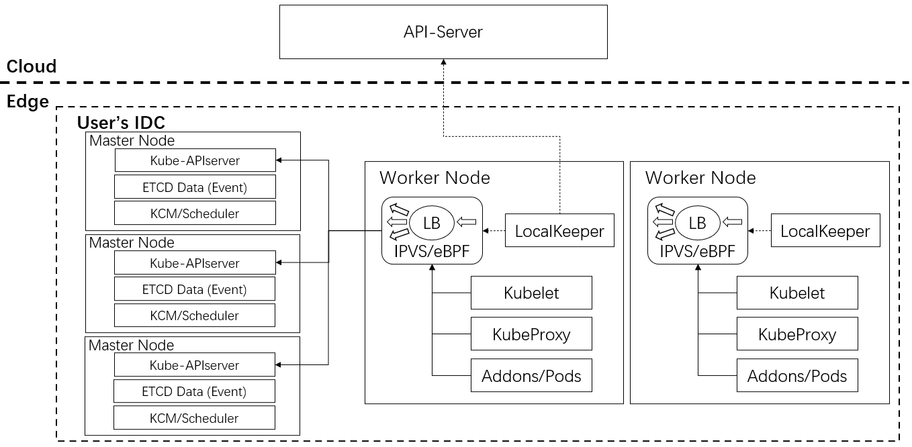

# Support local IDC cluster operation and maintenance 

## Glossary

Refer to the [OpenYurt Glossary](https://github.com/openyurtio/openyurt/blob/master/docs/proposals/00_openyurt-glossary.md)

## Summary

The proposal aims to adopt the k8s on k8s architechture to provide control plane operation and maintenance solution for user-built clusters, sinking user's cluster control plane from the cloud to the edge, not only is there a significant reduction in cloud-side traffic, but the impact of cloud-side communication failures on user's releasing services is also reduced.

## Motivation

For user-built IDC k8s clusters, it is difficult to operation and maintenance control plane, which is updated frequently, about three major releases per year. Meanwhile, there is not autoscaling in user-built IDC k8s clusters. Usually, the user will put control plane into the OpenYurt cloud, and the worker nodes in the self-built IDC, through a dedicated line into the cloud for management. In this case, above problems are solved, but there are some shortcomings:
- When large-scale nodes are accessed, or edge applications are created and deleted on a large scale, the dedicated bandwidth between cloud and edge may be saturated, thus affecting the stability and availability of the cluster. It will also bring considerable traffic costs to the users.
- When dedicated communication between cloud and edge failures, it will affects user's services to release.

### Goals

- Using the k8s on k8s architecture, sinking user's cluster control plane from the cloud to the edge, not only is there a significant reduction in cloud-side traffic, but the impact of cloud-side communication failures on user's releasing services is also reduced.

### Non-Goals/Future Work

## Proposal
### Architechture

- Create the control plane of the local cluster on the three master nodes of the IDC (components are all deployed using Pods). 
- Through the node access tool, worker nodes in the IDC are accessed to the Local cluster.
- The LocalKeeper component on the node is mainly used for communication link maintenance, and the load balancing of Edge-Kube-APIServer access is realized by maintaining IPVS/eBPF or other schemes from the information in Cloud-Kube-APIServer on the worker node.

